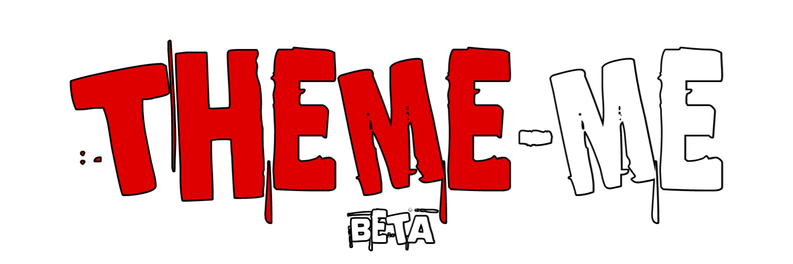
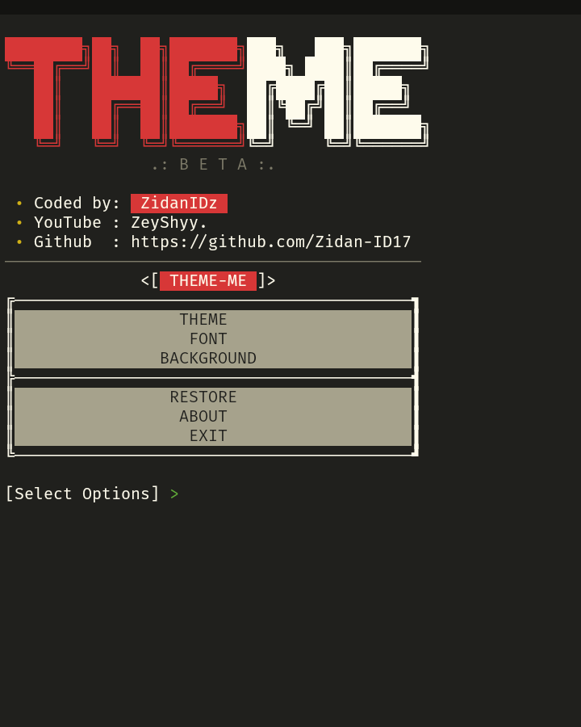
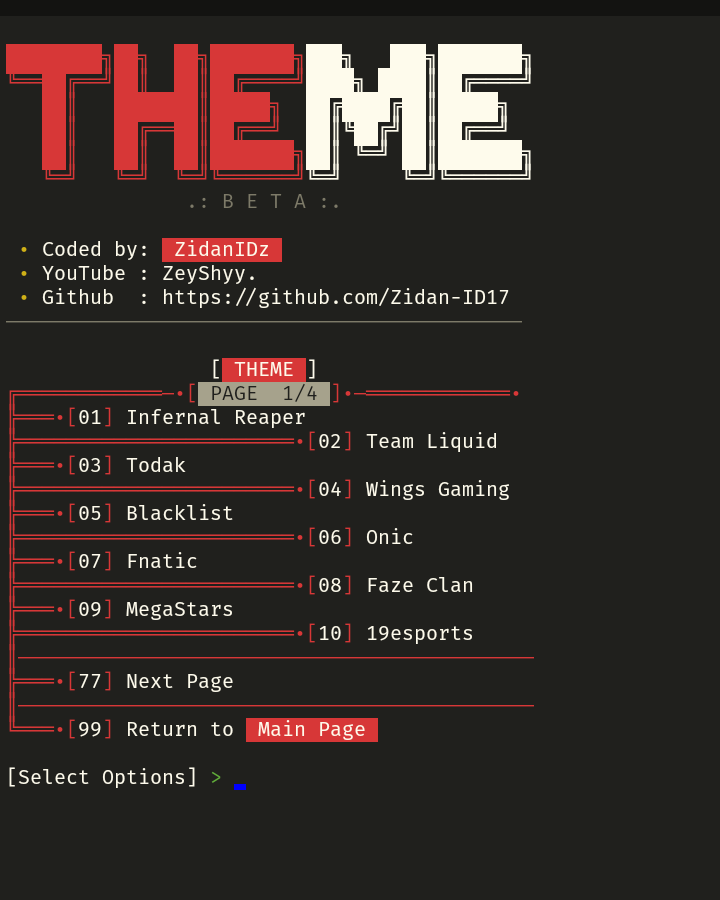
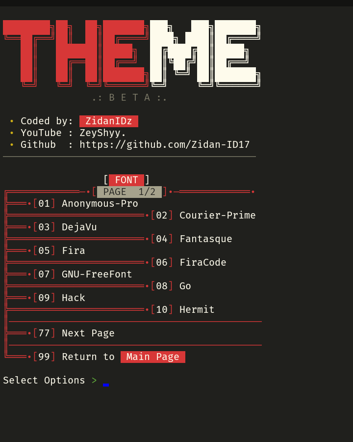
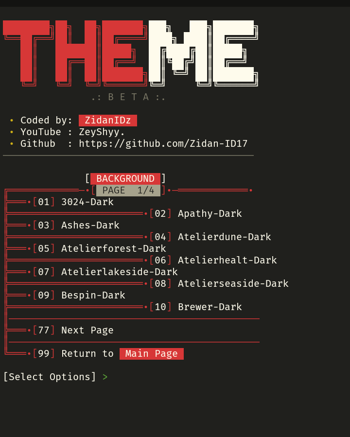

  

## Informasi
 

## Deskripsi
"Theme-Me" adalah tools sederhana yang dibuat untuk meningkatkan pengalaman pengguna Termux. Dengan alat ini, Kalian dapat mengubah tema, font, dan latar belakang terminal sesuai keinginan. Meskipun fitur-fitur saat ini mungkin masih terbatas, saya berencana untuk menambahkan fitur-fitur yang lebih menarik di masa mendatang.. 

[!] Stay Tune!!

## Gambar

  
  
  
  

## Pemasangan
Anda dapat mengunjungi [Channel Ini](https://www.youtube.com/@ZeyShyy.).
